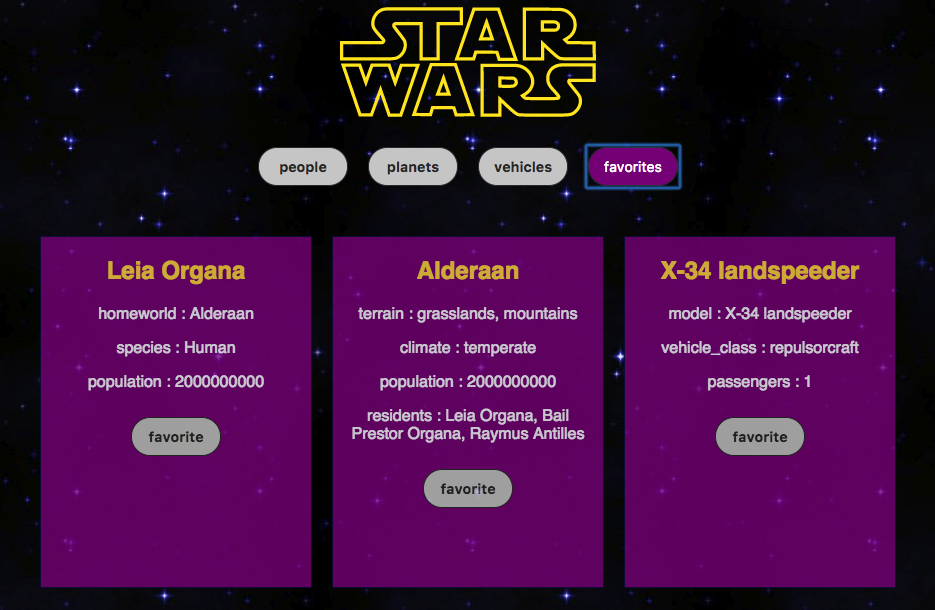

# SWapi Box
This is a project to show information using the [Star Wars API](https://swapi.co/api), which has a series of nested API endpoints. It features a complete testing suite - including mocking fetch calls and error handling - in Jest and Enzyme. 

#### Stack
- React
- Fetch API

#### Example of people cards:  

  

#### Cards are able to be favorited and persist:  

  
